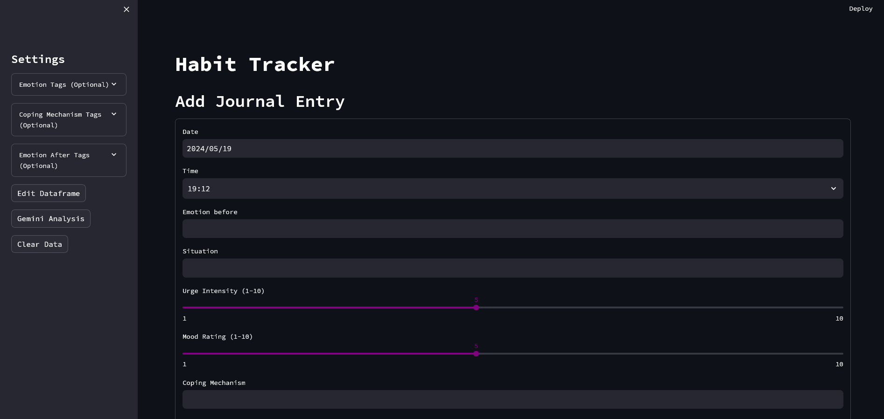
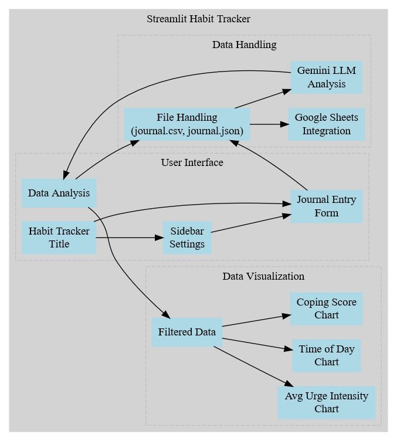
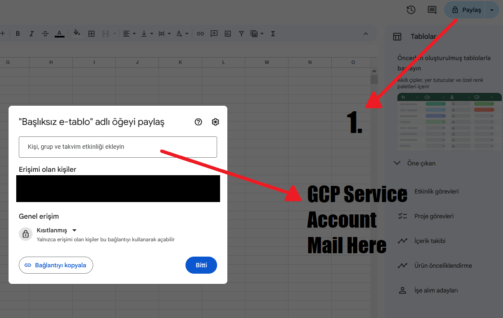
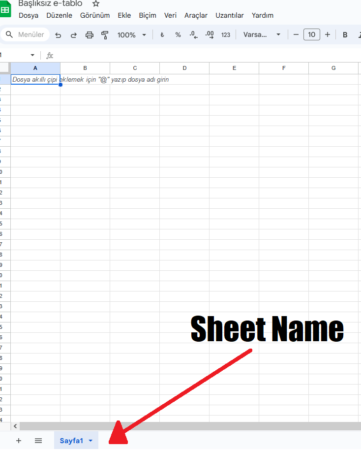

# Streamlit Habit Tracker App



---

## Description

🖥️ An application I made to keep track of my habit patterns, using data visualization and generative AI analysis for better insights and self-improvement.



## Table of Contents

- [Overview](#overview)
- [Features](#features)
- [Setup](#setup)
- [Usage](#usage)
- [Spreadsheet Url](#spreadsheet-url)

## Overview

The Habit Tracker app allows users to log their daily habits, emotions, and coping mechanisms. It provides data visualization tools to analyze trends and insights. Additionally, it integrates with Google Sheets for data storage and utilizes Google's generative AI for advanced analysis.

## Features

- **User-friendly Interface**: Easy-to-use forms for logging habits.
- **Data Storage**: Save entries locally in CSV and JSON formats.
- **Google Sheets Integration**: Upload data to Google Sheets for backup and further analysis.
- **Generative AI Analysis**: Use Google's Gemini AI to analyze habits and generate insights.
- **Data Visualization**: Visualize data trends using Altair charts.

## Setup

### Prerequisites

- Python 3.8 or higher
- Streamlit
- Pandas
- Altair
- Gspread
- Google Generative AI library
- Google OAuth2

### Installation

1. Clone the repository:

    ```bash
    git clone https://github.com/asaykal/habit-tracker
    cd habit-tracker
    ```

2. Install the required Python packages:

    ```bash
    pip install -r requirements.txt
    ```

3. Set up your Google Cloud Platform credentials:
    - Create a service account and download the JSON key file.
    - Save the JSON file and update your Streamlit secrets.

4. Create the necessary files:
    - `journal.csv`: An empty CSV file to store journal entries.
    - `emotions.md`, `cope.md`, `after_emotions.md`: Files containing tags for emotions and coping mechanisms.

### Streamlit Secrets Configuration

Update your Streamlit secrets with the following information:

```yaml
# .streamlit/secrets.toml
[gcp_service_account]
type = "service_account"
project_id = "your-project-id"
private_key_id = "your-private-key-id"
private_key = "your-private-key"
client_email = "your-client-email"
client_id = "your-client-id"
auth_uri = "https://accounts.google.com/o/oauth2/auth"
token_uri = "https://oauth2.googleapis.com/token"
auth_provider_x509_cert_url = "https://www.googleapis.com/oauth2/v1/certs"
client_x509_cert_url = "your-client-x509-cert-url"

[default]
gemini_api_key = "your-gemini-api-key"
spreadsheet_url = "your-google-sheet-url"
```

## Usage

1. Run the Streamlit app:

    ```bash
    streamlit run app.py
    ```

2. Open the app in your browser.

3. Use the sidebar to configure settings and tags for emotions and coping mechanisms.

4. Add journal entries using the provided form.

5. View data analysis and insights on the main page.

## Spreadsheet Url



For using spreadsheet url, you need to share your google sheet with the service account email.

## Sheet Name



Change the sheet name in your spreadsheet to `Journal`.

---

